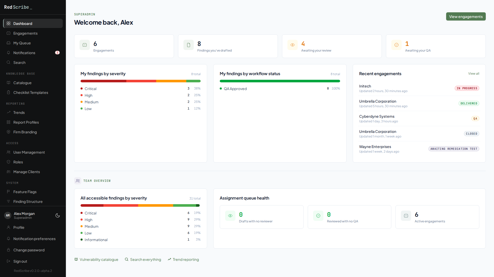
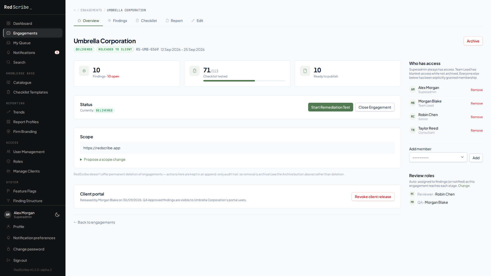
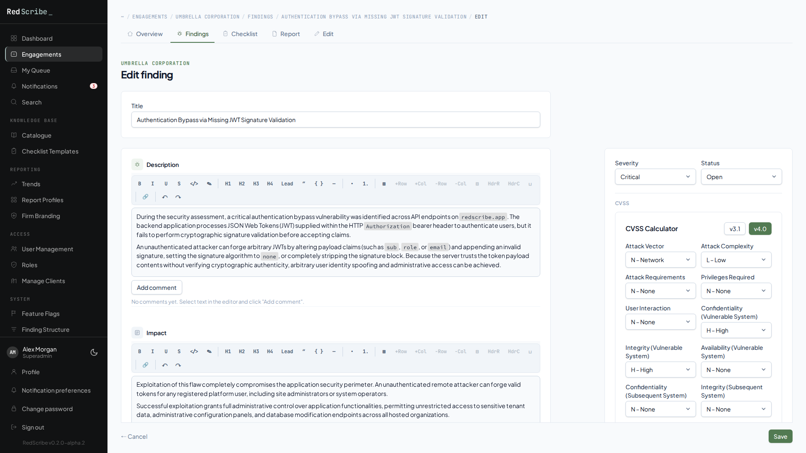
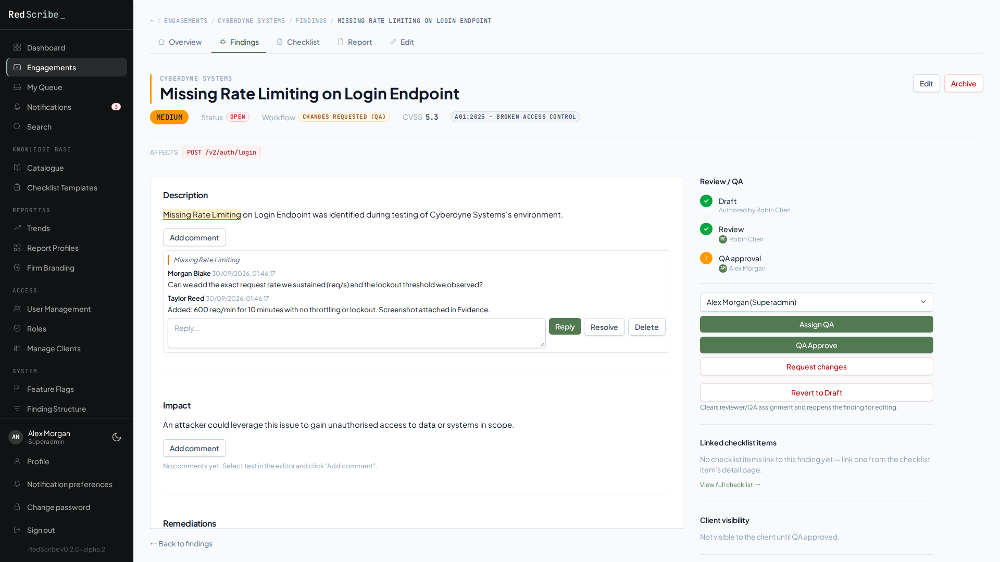
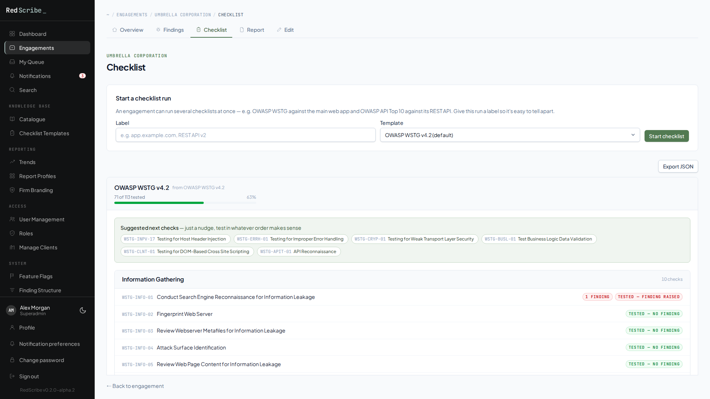
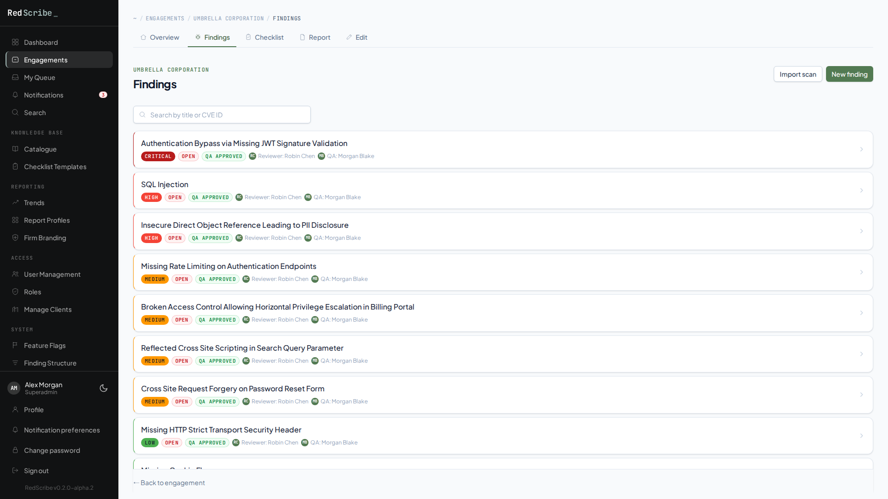
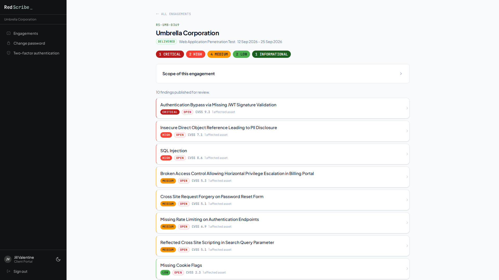
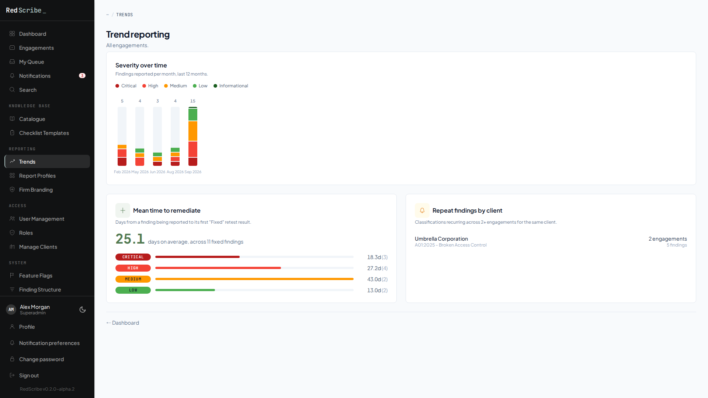
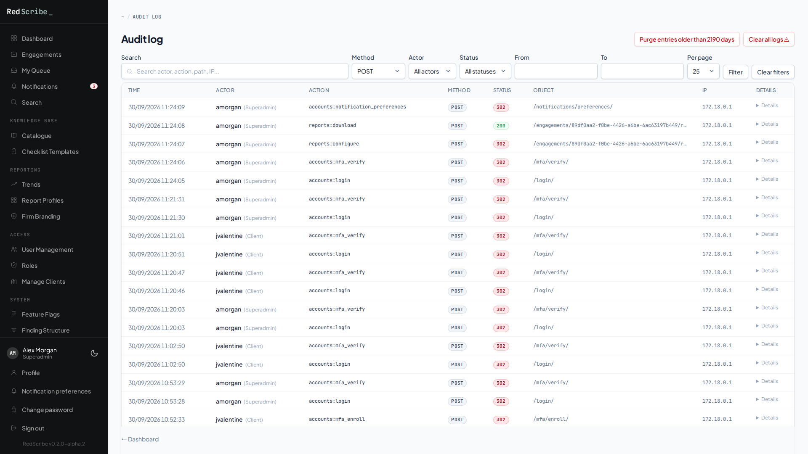
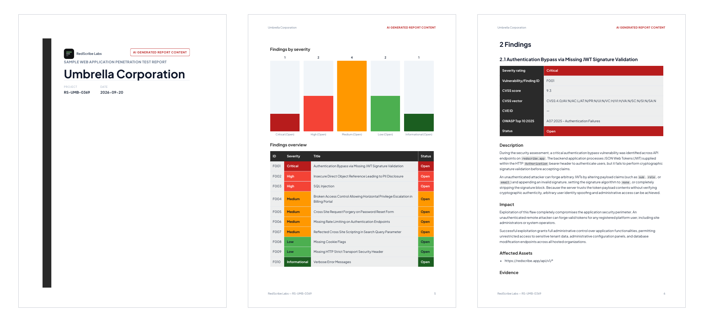

<div align="center">


# RedScribe

**From first finding to final sign-off.**

Self-hosted engagement, finding, checklist, and report management<br>
for penetration testing teams.

[](CHANGELOG.md)
[](#license)
[](https://docs.redscribe.app)
[](requirements.txt)
[](requirements.txt)

[**Website**](https://redscribe.app) ·
[**Documentation**](https://docs.redscribe.app) ·
[**Quickstart**](#quickstart) ·
[**Sample report (PDF)**](https://docs.redscribe.app/sample-report.pdf) ·
[**Changelog**](CHANGELOG.md)

</div>

<br>

<picture>
  <source media="(prefers-color-scheme: dark)" srcset="docs/screenshots/dashboard-dark.png">
  
</picture>

> [!WARNING]
> **This is alpha software** (`0.2.0-alpha.4`), not yet production-ready.
> Expect rough edges and breaking changes between releases; see
> [Alpha status](#alpha-status) before relying on it for a real engagement.

## Built for the whole team

One engagement, everyone who touches it, on infrastructure you control.

<table>
  <tr>
    <th width="33%" align="left">Testers</th>
    <th width="33%" align="left">Reviewers and QA</th>
    <th width="33%" align="left">Team leads</th>
  </tr>
  <tr>
    <td valign="top">Work OWASP WSTG (or your own) checklists, write findings with a built-in CVSS v3.1/v4.0 calculator, and import Nmap, Burp Suite, or Nuclei output.</td>
    <td valign="top">Draft → review → QA with named assignees, comments anchored to the exact text, and a queue of only what's assigned to you.</td>
    <td valign="top">Every engagement's status, team, default reviewer and QA, scope-change approvals, and queue health, then one report in PDF, Word, HTML, or Markdown.</td>
  </tr>
</table>

**Contents:**
[What's inside](#whats-inside) ·
[Screenshots](#screenshots) ·
[Quickstart](#quickstart) ·
[Tech stack](#tech-stack) ·
[Repository layout](#repository-layout) ·
[Contributing](#contributing) ·
[Versioning](#versioning) ·
[Alpha status](#alpha-status) ·
[License](#license)

## What's inside

A short highlight list, not the full picture. See the
[User Guide](https://docs.redscribe.app/user-guide/login-and-mfa/) and
[Security](https://docs.redscribe.app/security/encryption/) sections of the
docs for the complete feature set.

- **Workflow:** engagement → finding → report, with draft → review → QA,
  CVSS v3.1/v4.0, retest tracking, and recurring-vulnerability detection.
- **Reporting:** a shared report IR driving Markdown/PDF/HTML/DOCX export
  from one source. DOCX fills in your own uploaded Word template rather than
  generating from scratch.
- **Security:** per-engagement AES-256-GCM encryption at rest, dynamic RBAC,
  TOTP MFA, and an append-only, hash-chained audit log.
- **Clients and coverage:** a read-only client portal, checklist runs (OWASP
  WSTG and your own templates) with Nmap/Burp Suite/Nuclei scanner import,
  and cross-engagement trend reporting.
- **Operations:** server-side encrypted backup/restore, and Docker Compose
  deployment with automated Tailscale TLS or a bring-your-own certificate.

## Screenshots

Captured from a live instance seeded with the demo engagement behind the
[sample PDF report](https://docs.redscribe.app/sample-report.pdf). Click any
image for the full-size version.

<table>
  <tr>
    <td width="50%" valign="top">
      <a href="docs/screenshots/engagement-detail.png"></a>
      <br><b>Engagement overview</b>: status lifecycle, scope, checklist progress, team access, and default reviewer/QA.
    </td>
    <td width="50%" valign="top">
      <a href="docs/screenshots/finding-editor.png"></a>
      <br><b>Finding editor</b>: rich-text sections, severity, and a built-in CVSS v3.1/v4.0 calculator.
    </td>
  </tr>
  <tr>
    <td width="50%" valign="top">
      <a href="docs/screenshots/finding-review.png"></a>
      <br><b>Review and QA</b>: draft → review → QA with inline, anchored comment threads.
    </td>
    <td width="50%" valign="top">
      <a href="docs/screenshots/checklist-run.png"></a>
      <br><b>Checklists</b>: OWASP WSTG (or your own template) runs, linked to the findings they raise.
    </td>
  </tr>
  <tr>
    <td width="50%" valign="top">
      <a href="docs/screenshots/findings-list.png"></a>
      <br><b>Findings</b>: severity, status, workflow stage, and who's reviewing each one, at a glance.
    </td>
    <td width="50%" valign="top">
      <a href="docs/screenshots/client-portal.png"></a>
      <br><b>Client portal</b>: a read-only view of QA-approved findings for the client's own users.
    </td>
  </tr>
  <tr>
    <td width="50%" valign="top">
      <a href="docs/screenshots/trends.png"></a>
      <br><b>Trends</b>: severity over time, mean time to remediate, and repeat findings by client.
    </td>
    <td width="50%" valign="top">
      <a href="docs/screenshots/audit-log.png"></a>
      <br><b>Audit log</b>: append-only, hash-chained record of every request, filterable by actor, method, and date.
    </td>
  </tr>
</table>

The exported report, from the same engagement
([download the full 38-page PDF](https://docs.redscribe.app/sample-report.pdf)):

<a href="https://docs.redscribe.app/sample-report.pdf"></a>

## Quickstart

The fastest way to try it locally, with no TLS and no domain. You need
Docker with the Compose plugin.

```sh
cp .env.example .env
touch secrets/root_key.txt  # filled in below, after the app is up
python3 -c "import secrets, string; print(''.join(secrets.choice(string.ascii_letters + string.digits) for _ in range(50)))" > secrets/django_secret_key.txt
openssl rand -base64 32 > secrets/postgres_password.txt
docker compose up -d --build
docker compose exec web python manage.py generate_root_key
# copy the printed value into secrets/root_key.txt, then:
docker compose up -d web
```

Open `http://localhost:8000/setup/` to create the first Superadmin. TOTP
MFA enrollment happens automatically on first login.

> [!TIP]
> For a real deployment (automated Tailscale HTTPS, your own TLS
> certificate, sizing guidance, and the full environment variable
> reference), see [Installation](https://docs.redscribe.app/getting-started/installation/)
> and [Configuration](https://docs.redscribe.app/getting-started/configuration/)
> in the docs.

## Tech stack

| Layer | What it uses |
|---|---|
| Application | Python 3.13, Django 5.2, served by Gunicorn |
| Database | PostgreSQL 17 |
| Frontend | Server-rendered Django templates, Tailwind CSS 4, Tiptap 3 rich-text editor |
| Reports | WeasyPrint (PDF), docxtpl (Word, from your own `.docx` template) |
| Auth | django-otp (TOTP MFA), django-allauth (optional Google / Microsoft sign-in) |
| Deployment | Docker Compose, nginx, optional Tailscale-issued TLS |

Frontend sources are compiled into `static/`; see [`BUILD.md`](BUILD.md)
for how the asset builds work.

## Repository layout

| Path | Contents |
|---|---|
| [`apps/`](apps) | Django apps: accounts, engagements, findings, checklist, reports, clients, audit, crypto, backup, and more |
| [`config/`](config) | Django settings (`base`, `dev`, `prod`) and URL routing |
| [`templates/`](templates) | Server-rendered page templates |
| [`static/`](static) | Built CSS/JS and the app's own scripts (CVSS calculator, editor) |
| `tailwind-src/`, `editor-src/`, `datepicker-src/`, `strength-src/` | Frontend sources: Tailwind theme, Tiptap editor, date picker, password-strength meter |
| [`docs/`](docs) | In-repo guides (DOCX template guide, report template tags, checklist templates) and README screenshots |
| [`nginx/`](nginx), [`scripts/`](scripts) | Reverse-proxy templates and helper scripts |
| [`secrets/`](secrets) | Docker secret files (gitignored); its [README](secrets/README.md) explains each one |

## Contributing

Issues are welcome; pull requests aren't.

- **Found a bug or want a feature?** Open an issue. The templates under
  `.github/ISSUE_TEMPLATE/` ask for the details that actually help
  reproduce a problem in a self-hosted Django app (version, install
  method, whether it reproduces on a clean instance).
- **Pull requests aren't accepted.** Every code change, fixes included, is
  made by the maintainers directly. If you'd like something changed, open an
  issue describing it instead; a PR will be closed unmerged. See
  [`CONTRIBUTING.md`](CONTRIBUTING.md).
- **Found a security vulnerability?** Don't open a public issue for it.
  See [`.github/SECURITY.md`](.github/SECURITY.md) for private reporting.
- Everyone participating is expected to follow the
  [Code of Conduct](CODE_OF_CONDUCT.md).

## Versioning

[Semantic Versioning](https://semver.org/): `MAJOR.MINOR.PATCH`, with a
`-alpha.N` / `-beta.N` / `-rc.N` pre-release suffix before the first
`1.0.0`. The current version lives in `VERSION` (repo root) and is tagged
in git as `v<version>`. `CHANGELOG.md` follows
[Keep a Changelog](https://keepachangelog.com/), and every release gets a
dated entry there before being tagged. See
[Cutting a release](https://docs.redscribe.app/start/alpha-status/#cutting-a-release-maintainers)
in the docs for the release steps.

Pre-1.0, expect breaking changes on minor bumps (`0.1.0` → `0.2.0`). That's
normal during alpha, not a mistake.

## Alpha status

RedScribe is early alpha (`0.2.0-alpha.4`). Expect rough edges and
breaking changes between releases. Worth knowing before relying on it for a
real engagement (full list in the
[docs](https://docs.redscribe.app/start/alpha-status/)):

- **No public API.** Every workflow is web-UI-driven.

See `CHANGELOG.md` for the full, dated history of what's changed release
to release.

## License

RedScribe is **source-available**, not [OSI-approved open source](https://opensource.org/osd).
The source is public and modifiable, but the license restricts commercial
use, which the Open Source Definition doesn't permit. That puts it in the
same category as Sentry's Functional Source License, n8n's Sustainable Use
License, Chatwoot's, and MariaDB's Business Source License.

| | Personal and noncommercial | Commercial (including for-profit consultancies) |
|---|---|---|
| **License** | [PolyForm Noncommercial 1.0.0](LICENSE) | [Commercial license](COMMERCIAL-LICENSE.md) |
| **Cost** | Free | **Free for the first year** right now |
| **Features** | Everything | Everything, with no differences from the free tier |

**Commercial use is free right now.** As a kickstart for the community, a
commercial license key costs nothing for the first year: email
`redscribe.maintainer@proton.me` for one. Priced tiers begin once RedScribe
has been proven at the scale real enterprise engagements demand.

Nothing in RedScribe is feature-gated either way. See
[`COMMERCIAL-LICENSE.md`](COMMERCIAL-LICENSE.md) for full terms and
pricing.

<br>

<div align="center">
  <sub>
    <a href="https://redscribe.app">redscribe.app</a> ·
    <a href="https://docs.redscribe.app">docs.redscribe.app</a> ·
    <a href="https://github.com/redscribe-labs/redscribe/issues">Issues</a>
  </sub>
</div>
